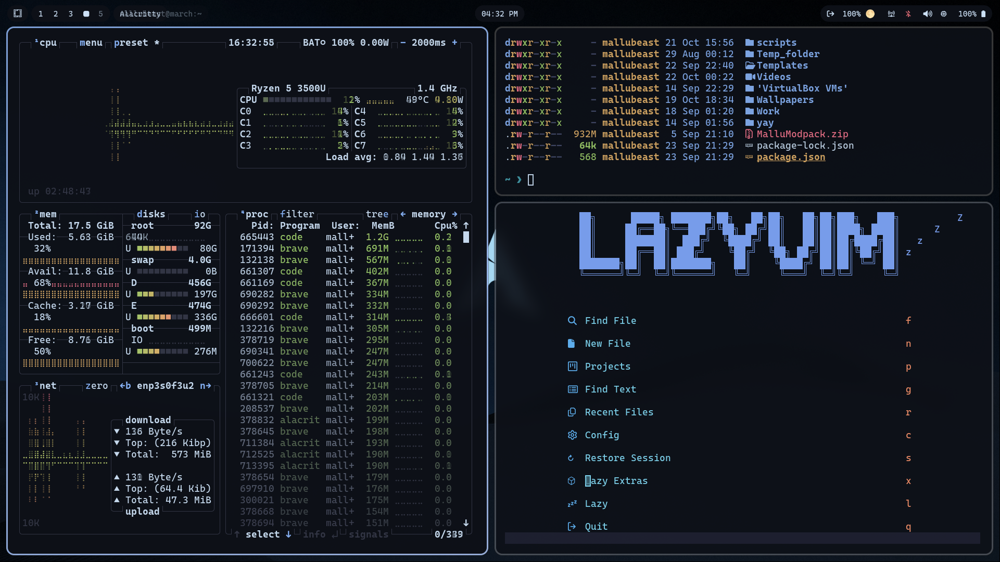

# Omarchy Blue Land Theme

This is the Blue Land Theme for [Omarchy.org](https://omarchy.org), providing a cohesive and visually appealing configuration set for your Linux desktop environment.

<p align="center">
  
</p>

>Beneath the vast, inky blue expanse,
>Where silent dunes in moonlight dance.
>A tranquil realm, of deep sapphire hue,
>A desert dream, eternally new.
>This is the blue land, serene and profound,
>Where peace in the quiet night is found.

## Installation

To install this theme, simply use the `omarchy-theme-install` command:

```bash
omarchy-theme-install https://github.com/muhammad-shameel-ks/blue-land-omarchy-theme